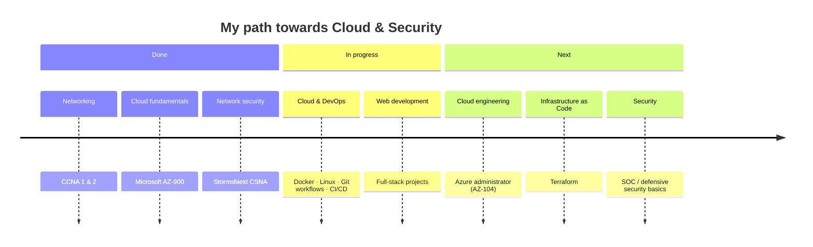

<!-- ═══════════════ HEADER ═══════════════ -->
<div align="center">


<a href="https://git.io/typing-svg">
  
</a>

<br/>


</div>

---

## 👋 About me

I'm **Yacine**, a student in the **Bachelor Coordinateur de Projets Informatiques** at [Enigma School](https://www.enigma-school.com/). I'm passionate about **cloud infrastructure, networking and cybersecurity**, and I enjoy building things end to end, from the network layer to the web application.

I'm curious, detail-oriented and driven by one goal: **contribute to innovative, high-impact projects** while learning from experienced engineers.

```yaml
name: Yacine
role: IT Student — Cloud / Cybersecurity / Software Development
school: Enigma School (Bachelor Coordinateur de Projets Informatiques)
location: Lille, France
certifications: [CCNA 1 & 2, Microsoft AZ-900, Stormshield CSNA]
languages: [French, English]
seeking:
  internship: "May 2027 — 2 months"
  work_study: "September 2027 — 2 to 3 years"
```

---

## 🎯 What I'm looking for

| | Type | Start | Duration | Fields |
|:-:|---|---|---|---|
| 🧪 | **Internship** | May 2027 | 2 months | Cloud Computing · Cybersecurity · Software Development |
| 🤝 | **Work-study (alternance)** | September 2027 | 2 to 3 years | Cloud / DevOps · Cybersecurity · Front-end, Back-end or Full-stack |

> 💬 **En français :** je recherche un **stage de 2 mois (mai 2027)** pouvant mener à une **alternance de 2 à 3 ans (septembre 2027)** dans le **cloud**, la **cybersécurité** ou le **développement logiciel**. N'hésitez pas à me contacter !

---

## 🛠️ Tech stack

### 💻 Languages

<p>
  
</p>

### ☁️ Cloud & Infrastructure

<p>
  
</p>

### 🌐 Networking & Security


### 🧩 Methods & soft skills


---

## 🏅 Certifications

<div align="center">

| Certification | Issuer | Domain |
|---|---|---|
|  | Cisco Networking Academy | Networking fundamentals, switching, routing |
|  | Microsoft | Cloud concepts, Azure services, security & pricing |
|  | Stormshield | Network security, next-gen firewall administration |

</div>

---

## 🗺️ Learning roadmap



---

## 📌 Featured projects

> 🚧 *Add your best 3 to 6 projects here. Use the same format for each one.*

| Project | Description | Stack |
|---|---|---|
| 🔗 [**project-name**](https://github.com/YacineKht/project-name) | One sentence: what problem it solves and what you built. |   |
| 🔗 [**project-name**](https://github.com/YacineKht/project-name) | One sentence: what problem it solves and what you built. |   |
| 🔗 [**project-name**](https://github.com/YacineKht/project-name) | One sentence: what problem it solves and what you built. |  |

---

## 📊 GitHub stats

<div align="center">


</div>

---

## 📫 Let's connect

<div align="center">

[](https://www.linkedin.com/in/YOUR-LINKEDIN/)
[](mailto:YOUR-EMAIL@example.com)
[](https://github.com/YacineKht)

<sub>💡 Open to opportunities in the Lille area, the Hauts-de-France region and Belgium.</sub>

</div>


